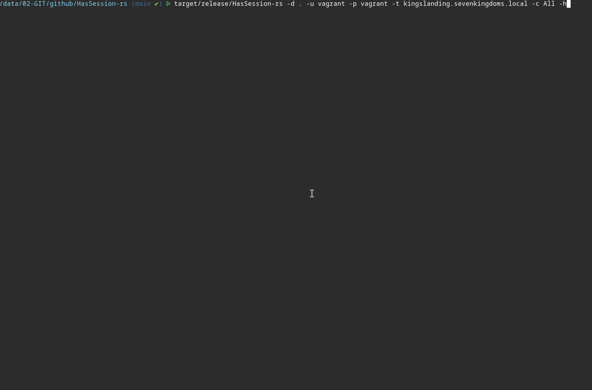

<h1 align="center">HasSession-rs</h1>

<hr />

`HasSession-rs` is a tool to enumerate Windows sessions across one or more hosts via **three native RPC interfaces**,
correlate every observation into a BloodHound `HasSession`-like JSON report.

Built entirely on **[icedracon/dcerpc](https://github.com/icedracon/dcerpc)**'s pure-Rust DCE/RPC stack.

> **Authorized use only.** Dual-use enumeration. Run only against hosts you
> administer or are explicitly authorized to audit.

---

## What it does

For each target host, `HasSession-rs` opens an authenticated SMB2 session (NTLMv2) and runs up to three RPC calls in sequence:

1. **SRVSVC / `NetrSessionEnum`** - inbound SMB sessions (client IP + username).
2. **WKSSVC / `NetrWkstaUserEnum`** - users with an active logon context on the machine.
3. **WINREG / `HKEY_USERS`** - SIDs of loaded profile hives (= logged-on users).

Every result is folded into two output structures:

- `edges` - flat list of `{ principal, host, method }` observations.
- `by_user` - `principal [hosts]`, the attacker-useful "where is this account
  right now?" pivot (equivalent of a BloodHound `HasSession` edge).

All three interfaces are **native in `dcerpc`** - no local wrapper modules needed.
WKSSVC (`dcerpc::wkssvc`) and the HKEY_USERS registry path (`dcerpc::rrp`) were
added to the crate by icedracon alongside the already-existing SRVSVC client.

---

## Session-collection methods

No single method sees everything; tools like SharpHound and BloodHound run all
three and correlate them for the same reason.

| | **NetSessionEnum** | **NetWkstaUserEnum** | **Remote Registry (HKU)** |
|---|---|---|---|
| **RPC interface** | SRVSVC (MS-SRVS) | WKSSVC (MS-WKST) | WINREG / RRP (MS-RRP) |
| **`dcerpc` module** | `dcerpc::srvsvc` | `dcerpc::wkssvc` | `dcerpc::rrp` |
| **Named pipe** | `\srvsvc` | `\wkssvc` | `\winreg` |
| **Operation** | `NetrSessionEnum` opnum 12, level 10 | `NetrWkstaUserEnum` opnum 2, level 1 | `OpenHKU` + `BaseRegEnumKey` on `HKEY_USERS` |
| **What it sees** | Inbound **SMB sessions**: client IP + user | Users with an **active logon context** on the machine | SIDs of **loaded profile hives** (NTUSER.DAT mounted) |
| **Admin required?** | **No** on unpatched hosts (Authenticated Users); **Yes** on hardened Win10 1607 / Server 2019+ | **Yes** - local admin on the target | **No** in principle (Everyone: Read on HKU); the real gate is the service |
| **Prerequisite / gate** | `SrvsvcSessionInfo` ACL (NetCease hardening changes this) | Local Administrators membership | **RemoteRegistry service** must be running (off by default on modern Windows) |
| **Best target** | File servers, DCs - everyone connects there | Workstations | Workstations |
| **BloodHound edge** | `Session` / HasSession | `LoggedOn` (PrivilegedSessions) | `LoggedOn` (RegistrySessions) |

### Practical notes

**SRVSVC** is domain-account centric - local accounts rarely open SMB sessions, so
they won't appear here. On Server 2019+ the ACL is hardened by default; a non-admin
account gets `rc=5 ERROR_ACCESS_DENIED` and zero results.

**WKSSVC** enumerates every logon session, including multiple sessions for the same
account (one per Logon ID). HasSession-rs deduplicates them automatically and filters
machine accounts (`$` suffix) which are noise on DC targets.

**Remote Registry** can produce false positives: a loaded hive means the account has
a logon context on the host (login took place), not necessarily an active interactive
session - service accounts, `SYSTEM`, and app pools appear too.

---

## Build & run

```sh
cargo build --release
./target/release/HasSession-rs --help

# Single host, username:password
HasSession-rs -d CORP -u alice -p 'P@ssw0rd' -t dc01.corp.local

# Single host, NT hash for Pass-the-Hash (NTLM)
HasSession-rs -d CORP -u alice -H :e02bc503339d51f71d913c245d35b50b -t dc01.corp.local

# Multiple hosts (comma-separated + file)
HasSession-rs -d CORP -u alice -p 'P@ssw0rd' \
  -t dc01.corp.local,fs01.corp.local \
  --targets-file hosts.txt

# SRVSVC only (no admin needed on unpatched hosts)
HasSession-rs -d CORP -u alice -p 'P@ssw0rd' -t dc01 -c SessionOnly

# Quiet mode - stdout is pure JSON, pipe-friendly
HasSession-rs -d CORP -u alice -p 'P@ssw0rd' -t dc01 -q | jq '.by_user'

# Debug mode
HasSession-rs -d CORP -u alice -p 'P@ssw0rd' -t dc01 -v

# Verbose / wire-level trace
HasSession-rs -d CORP -u alice -p 'P@ssw0rd' -t dc01 -vv
```

Flags: `-q` silences all log output (stdout stays JSON-only). Debug goes to
**stderr**, JSON to **stdout** - `| jq` always works.

---

## Example output

```json
{
  "domain": "CORP",
  "hosts_scanned": ["dc01.corp.local", "fs01.corp.local"],
  "edge_count": 3,
  "edges": [
    { "principal": "alice",              "host": "fs01.corp.local",  "method": "NetSessionEnum" },
    { "principal": "CORP\\administrator","host": "dc01.corp.local",  "method": "NetWkstaUserEnum" },
    { "principal": "S-1-5-21-...-1103", "host": "fs01.corp.local",  "method": "RegistryHKU" }
  ],
  "by_user": {
    "CORP\\administrator": ["dc01.corp.local"],
    "S-1-5-21-...-1103":   ["fs01.corp.local"],
    "alice":               ["fs01.corp.local"]
  }
}
```

<p align="center">
    <picture>
        
    </picture>
</p>

---

## Credits & references

Thanks to **icedracon (zevs)** for the pure-Rust DCE/RPC stack this project is built on https://github.com/icedracon

The three RPC interfaces used here are all now **native in `dcerpc`**:

| Module | Interface | Source |
|---|---|---|
| [`dcerpc::srvsvc`](https://github.com/icedracon/dcerpc/blob/main/src/srvsvc.rs) | SRVSVC / `NetrSessionEnum` | original |
| [`dcerpc::wkssvc`](https://github.com/icedracon/dcerpc/blob/main/src/wkssvc.rs) | WKSSVC / `NetrWkstaUserEnum` | added |
| [`dcerpc::rrp`](https://github.com/icedracon/dcerpc/blob/main/src/rrp.rs) | WINREG / `OpenHKU` + `BaseRegEnumKey` | extended |
